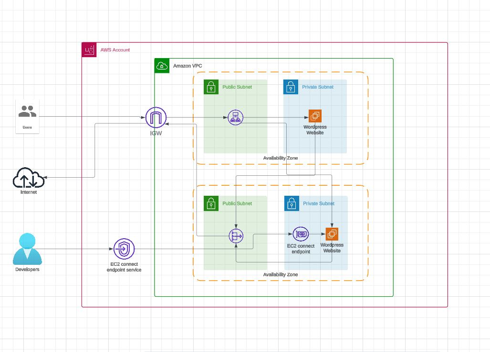
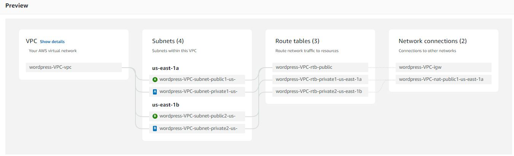
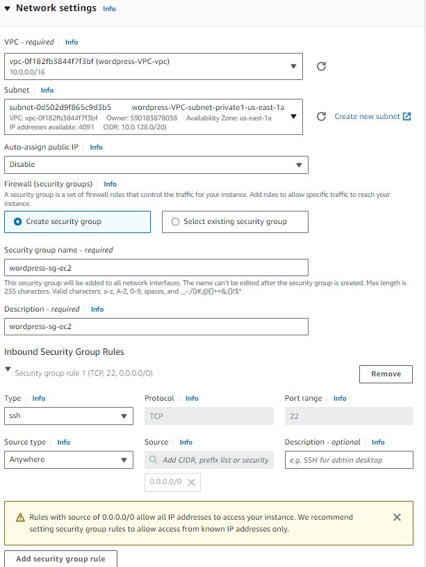
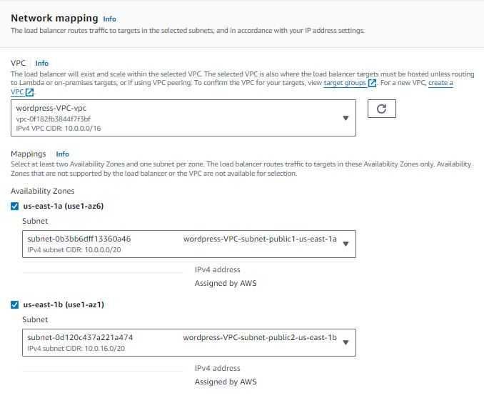
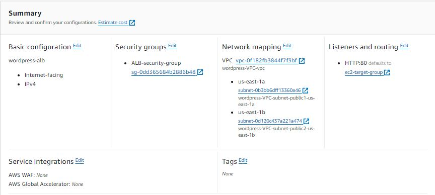
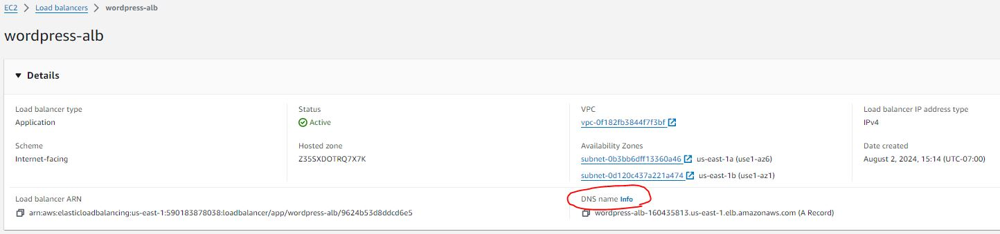
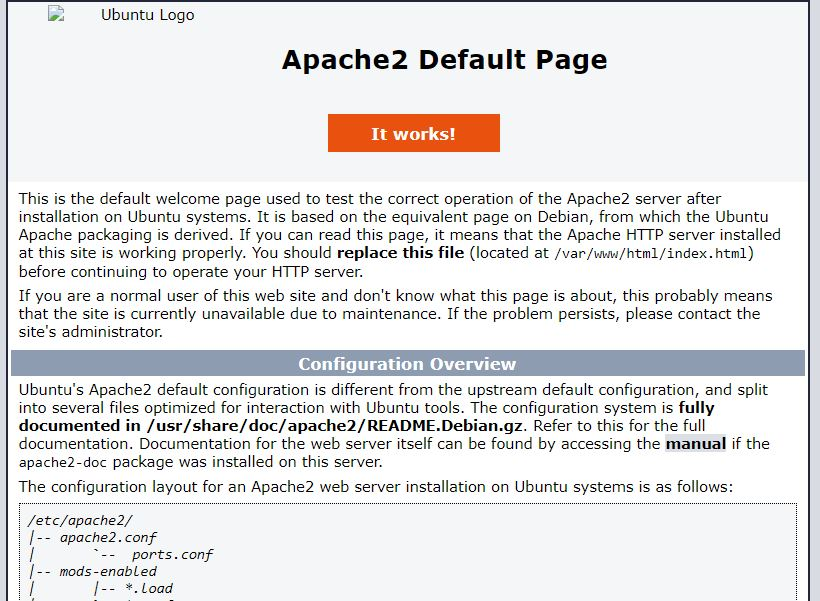
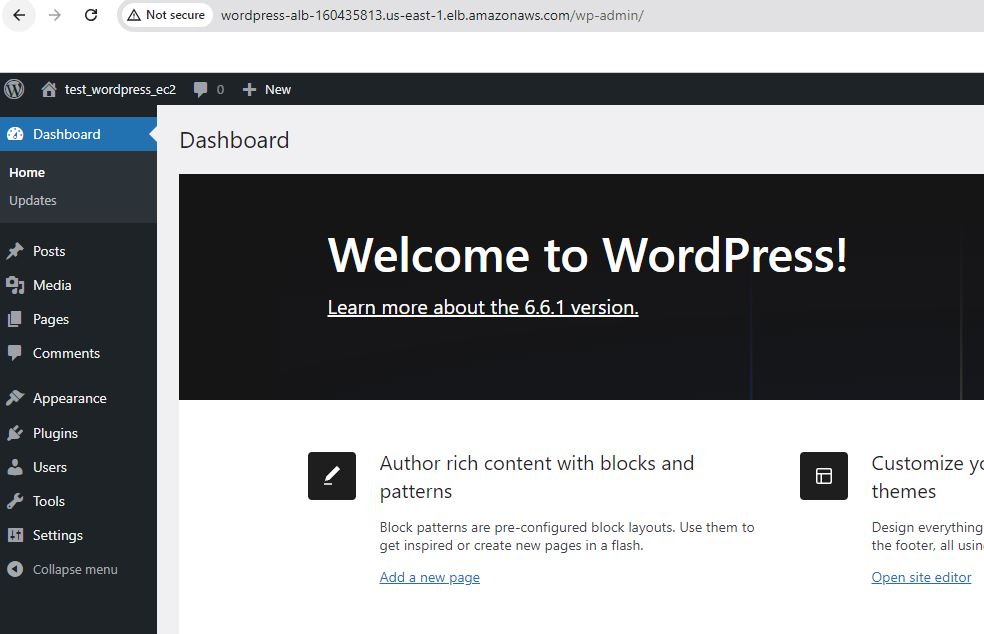

<h2>This blog will guide you through hosting a WordPress website on EC2, incorporating security best practices.</h2>

### ARCHITECTURE

### AWS services and Tools
* EC2
* Application Load Balancer
* VPC (private subnet & public subnet)
* EC2 Instance Connect Endpoint

### Steps taken to implement this architecture
1. Create a VPC.
2. Launch two EC2 instances.
3. Set up an ALB (Application Load Balancer).
4. Use Amazon's endpoint to install WordPress and the necessary packages on the EC2 instances.

## 1. Create a VPC
* Search for "VPC" in the search bar.
* Go to VPCs > Create VPC > VPC and more.
* In the Auto-generate box, name your VPC.
* Set the number of Availability Zones (AZs) to 2.
* Set the number of public subnets to 2.
* Set the number of private subnets to 2.
* Select NAT gateways in 1 AZ.
* Set VPC endpoints to None.
* Click Create VPC.

 

## 2. Launch two EC2 instances
### Launch your first EC2 instance
* Search for "EC2" in the search bar.
* Go to Instances > Launch instances.
* Name your EC2 instance.
* Select Ubuntu as your OS.
* Choose Proceed without a key pair (you do not need a key pair).
* Under Network settings, click Edit.
* Select the VPC you just created.
* Choose a private subnet from one of the availability zones.
* Name your security group so you can recognize it (we will change the security inbound rules later).
* Leave everything else as default.
* Click Launch instance.

### Launch your second EC2 instance
* Select a private subnet in a different availability zone (not the same as the first one).
* Select the existing security group you just named.

 

## 3. Set up an ELB (Application Load Balancer)
* Search for "Load balancers" in the search bar.
* Click on Create load balancer.
* Choose Application Load Balancer (since this is a web app).
* Click Create.
* Name your load balancer.
* Select the VPC you just created.
* Under Availability zones, select your AZ and pick your public subnet.
* Repeat this for both AZs.
  

 

* Under security groups:
* Click Create a new security group (this will open a new window).
* Name and describe your security group.
* Select your VPC.
* Under Inbound rules, set the Type to HTTP (since we are dealing with internet traffic).
* Set the Source type to Anywhere-IPv4.
* Click Add rule.
* Click Create security group.
* Go back to the previous tab and refresh the security groups.
* Select the security group you created for the ALB.
* In listeners and routing:
* Click Create target group (this will open a new tab).
* Under Basic configuration, select Instances.
* Name your target group.
* Ensure you select the correct VPC.
* Click Next.
* Select both instances you created.
* Click Include as pending below.
* Click Create target group.
* Go back to the previous page.
* Refresh the Select a target group dropdown.
* Select the target group you just created.
* Click Create load balancer.

### Your summary should look like this.

 

* In the left pane, find Network & Security > Security Groups.
* Select the security group created for the EC2 instances.
* Click Edit inbound rules.
* Set the Type to HTTP.
* Set the Source type to Custom.
* For Source, select the security group you created for the Application Load Balancer.
* Don't worry if the Application Load Balancer shows an unhealthy 502 error; this is because we have not set up our Apache server yet.

## 4. Use Amazon's endpoint to install WordPress and the necessary packages on the EC2 instances.
* Security Groups:
  * Go to Security Groups.
  * Select the security group you created for the EC2 instances.
  * Click Edit inbound rules.
  * Click Add rule.
  * Set the Type to SSH.
  * Set the Source type to Anywhere-IPv4.
  * Click Save rules.
  
* EC2:
  * Go to Instances.
  * Select an instance and click Connect.
  * Choose EC2 Instance Connect.
  * Click on the box to select an endpoint.
  * Click Create an endpoint (this will open a new tab).
    
* Create Endpoint:
  * Name your endpoint.
  * Select EC2 Instance Connect Endpoint.
  * Choose your VPC.
  * No need to pick a security group.
  * Select the private subnet in one of your AZs.
  * Click Create endpoint.
  * Go back to the previous page.
  
* Refresh the EC2 Instance Connect endpoint and click Connect (this will open a new terminal).

Follow [this article](.https://hackernoon.com/how-to-install-wordpress-on-linux-server-a-step-by-step-guide) to install wordpress on your ubuntu server.

### You should install wordpress in both EC2s

* Go to the AWS Console.
* Navigate to Load Balancers.
* Find the DNS of the load balancer you created.
* Copy the DNS name and paste it into your browser.

 

* You should see this if you have successfully followed the steps.

 

